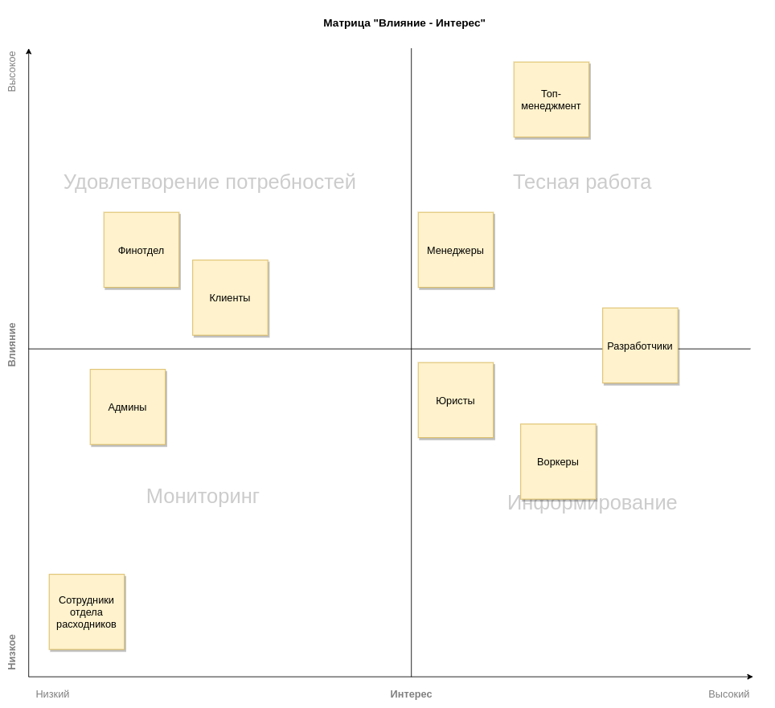
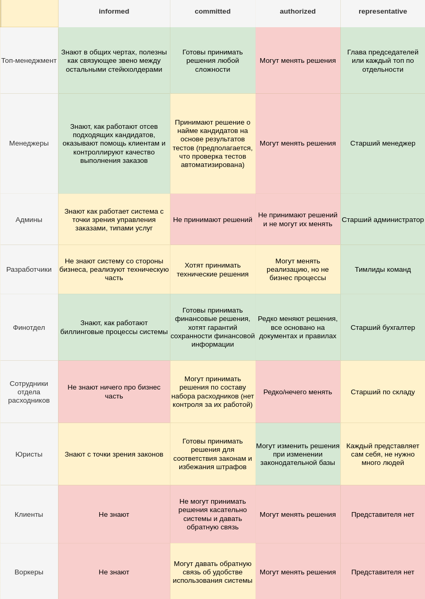
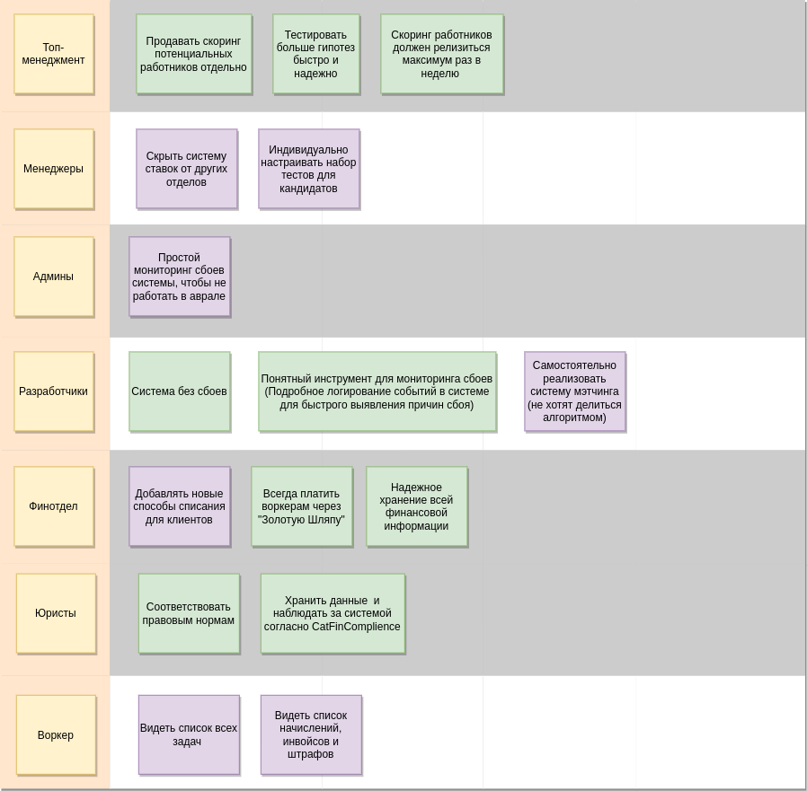

## Содержание

- [Содержание](#содержание)
- [Группировка стейкхолдеров](#группировка-стейкхолдеров)
  - [Матрица "Влияние-Интерес"](#матрица-влияние-интерес)
  - [Таблица важности](#таблица-важности)
  - [Консерны, сгруппированные по стейкхолдерам](#консерны-сгруппированные-по-стейкхолдерам)
- [Архитектурный стиль](#архитектурный-стиль)
  - [Выбор стиля для системы](#выбор-стиля-для-системы)
  - [Разделение контекстов по сервисам](#разделение-контекстов-по-сервисам)
  - [Архитектурные стили сервисов](#архитектурные-стили-сервисов)
- [Виды баз данных](#виды-баз-данных)
- [Виды коммуникаций](#виды-коммуникаций)
- [Валидация итоговой системы (фитнес функции)](#валидация-итоговой-системы-фитнес-функции)
  - [Общие для системы](#общие-для-системы)
  - [Расчеты, списания и выплаты](#расчеты-списания-и-выплаты)
  - [Планирование визитов](#планирование-визитов)
  - [Мэтчинг](#мэтчинг)
  - [Найм сотрудников](#найм-сотрудников)
- [Вопросы](#вопросы)

## Группировка стейкхолдеров

- Топ-менеджмент
  - Крайне заинтересованы в развитии системы, способны оказывать значительное влияние на бизнес решения, могут часто менять решения в зависимости от внешних и внутренних обстоятельств
- Менеджеры
  - Заинтересованы в развитии core поддоменов системы, могут оказывать влияние на связанные с этими поддоменами решениями
  - Пытался разбить на подгруппы, но не получается из-за общего консерна - скрытия тотализатора
- Финотдел
  - Нейтрально заинтересованы, могут влиять на финансовые решения, редко меняют решения
- Разработчики
  - Заинтересованы в развитии технической части системы, способны оказывать весомое влияние на технические решения, могут менять реализацию, но не бизнес процессы
- Админы
  - Мало заинтересованы в развитии системы, могут влиять на незначительные части системы
- Юристы
  - Мало заинтересованы в развитии, способны принимать важные решения
- Клиенты
  - Заинтересованы в развитии системы, не могут оказывать существенного влияния на решения
- Сотрудники отдела расходников
  - Мало заинтересованы в развитии системы, не оказывают влияние на решения
- Воркеры
  - Заинтересованы в развитии системы, оказывают незначительное влияние на решения

### Матрица "Влияние-Интерес"

### Таблица важности

### Консерны, сгруппированные по стейкхолдерам

Благодаря анализу групп в таблице (добавить изображение) группы "Клиенты", "Воркеры", "Админы" и "Сотрудники отдела расходников" не имеют консернов, важных на данный момент. Но учитывая, что лучше учитывать заранее как можно больше стейкхолдеров, добавил на матрицу группы. В дальнейшем их положение на матрицу может быть пересмотрено.

## Архитектурный стиль

Итоговое решение: **microservices**, по совокупности характеристик.

В ходе разбиения характеристик и консёрнов по bounded contexts изменил набор важных характеристик системы.
- Убрал reliability, она относилась только к проверке гипотез
- Добавил consistency, появился консёрн по надежности хранения финансовой информации
- Добавил securability, появились консёрны юристов по правовым нормам и CatFinComplience
- Добавил scalability, в ТЗ изменилась ожидаемая нагрузки по числу заказов

### Выбор стиля для системы

- Microkernel не подходит по тем же причинам, что и другие монолитные решения, а именно высокий ТТМ и невозможность масштабировать отдельные высоконагруженные сервисы
- Pipeline не подходит из-за узкой сферы применения, которая не актуальна для нашей системы. Но этот стиль вполне подходит для сервиса мэтчинга клиента и сотрудника
- Event-Driven стиль не подходит, так как его основные преимущества (performance и scalability) не критически важны на проекте. А сложность проектирования и низкий testability неприемлемы

### Разделение контекстов по сервисам

- 2 bounded contexts по расчету и списанию средств должны иметь отдельную БД из-за требования надежного хранения финансовой информации и CatFinComplience
- Контекст по работе с печеньками полностью является внешней системой
- Найм сотрудников следует вынести отдельно по нескольким причинам, уникальным только для этого контекста: elasticity, availability, другой релизный цикл, другой уровень средней нагрузки
- Мэтчинг сотрудника и клиента должен быть отдельным сервисом из-за отличающейся внутренней логики (из ТЗ - "Система чем-то похожа на map-reduce")
- Про тотализатор и говорить нечего - менеджеры явно дали знать, что хотят сделать его максимально изолированным и скрытым от остальных частей системы
- Контекст планирования визитов имеет требование по нагрузке (вроде бы), поэтому его стоит вынести отдельно. К тому же этот модель сложна и не стоит добавлять к ней в сервис что-либо еще
- Модель контроля качества работы тоже сложная, ее характеристики схожи с контекстом "Планирование визитов", но она заслуживает отдельного сервиса
- Сборка расходников для заказа помещается в отдельный сервис, так как не имеет особенных характеристик и требований, и в теории может быть заменена на внешний сервис

### Архитектурные стили сервисов

- Для тотализатора и сервиса сборки расходников подойдет layered monolith из-за простоты и отсутствия специфических требований от сервисов
- Для мэтчинга - pipeline, есть явная подсказка в ТЗ
- Для платежного сервиса - modular monolith, так как он содержит 2 контекста
- Для сервиса контроля качества работы - monolith
- Для отсева лучших кандидатов - microkernel, чтобы добавлять методы тестирования как плагины
- Для планирования визитов - важна scalability, возможно монолитные стили не очень подходят, но пусть будет monolith

## Виды баз данных

- Для сервиса по расчету и списанию денежных средств необходим высокий показатель consistency, поэтому изолированная БД будет реляционной
- Для мэтчинга важны связи и анализ характеристик, основные операции на чтение, поэтому выбор пал на Column Family БД
- Для сервиса отсева лучших кандидатов больше подойдет графовая БД, потому что большинство операций на запись и она подходит по показателям
- Для сервиса сбора расходников для заказа подойдет БД, ориентированная на чтение, реляционная БД вполне подходит
- Для тотализатора также подойдет реляционная БД, во многом благодаря простоте понимания и изучения
- Для сервиса контроля качества работы оптимальным выбором будет реляционная БД
- Для сервиса планирования визитов важен показатель scalability, поэтому можно попробовать Column Family БД

Итого, для большинства сервисов будет использоваться реляционная БД, для мэтчинга и планирования визитов - Column Family, а для отсева лучших кандидатов - графовая

Disclaimer - хорошо знаком только с реляционными БД, остальные выбирал по сухим характеристикам из таблицы

## Виды коммуникаций

- Связь от "Сборка расходников для заказа" до "Индивидуальная печенька с предсказанием" - Для взаимодействия с сервисом печенек подойдет синхронный вид, так как не известно, какие виды связи поддерживает внешняя система
- Связь от "Планирование визитов" до "Расчет и списание средств клиентов" - данные не нужно получать быстро, подойдет асинхронный event-driven стиль
- Связь от "Планирование визитов" до "Расчет и выплата средств сотрудникам" - данные не нужно получать быстро, подойдет асинхронный event-driven стиль
- Связь от "Планирование визитов" до "Сборка расходников для заказа" - данные не нужно получать быстро (нет требования в ТЗ по скорости взятия в работу заказа на сборку), подойдет асинхронный event-driven стиль
- Связь от "Планирование визитов" до "Тотализатор" - данные не нужно получать быстро, подойдет асинхронный event-driven стиль. Единственный нюанс - менеджеры вряд ли осилят сложность асинхронных коммуникаций, поэтому синхронный стиль также подойдет
- Связь от "Планирование визитов" до "Контроль качества работы" - данные не нужно получать быстро, подойдет асинхронный event-driven стиль
- Связь от "Планирование визитов" до "Мэтчинг сотрудника и клиента" - нет требований к скорости подбора воркера на заказ, подойдет асинхронный event-driven стиль
- Связь от "Отсев лучших кандидатов" до "Планирование визитов" - данные не нужно получать быстро, подойдет асинхронный event-driven стиль

## Валидация итоговой системы (фитнес функции)

### Общие для системы

- Test coverage не ниже N%
- Проверка периодичности релиза не реже раза в месяц. Использовать встроенные инструменты Jira по отслеживанию релизов, узнать у менеджеров, где взять информацию
- Вычисления процента ошибок сервера, downtime и прочих технических метрик с помощью Grafana. Установить приемлемые рамки для заданных метрик (проверка сбоев системы)
- Проверка реализации архитектурного стиля. Узнать у разработчиков, как можно автоматизировать и проверять

### Расчеты, списания и выплаты

- Периодическая проверка хранимой информации на наличие конфиденциальных пользовательских данных. Анализ данных в коммуникациях между сервисами

### Планирование визитов

- Прохождение нагрузочных тестов на scalability

### Мэтчинг

- Проверка coupling и cohesion

### Найм сотрудников

- Проверка coupling и cohesion
- Прохождение нагрузочных тестов на elasticity
- Проверка downtime не реже раз в месяц
- Проверка периодичности релиза не реже раза в неделю

## Вопросы

- Как реализовывать систему, которую нет смысла покупать, без разработчиков?
  - "Они хотят скрыть эту систему даже от разработчиков, которые не будут ей заниматься, и от начальства;" Не бредовый ли это консерн?
- Попахивает тех ограничением и "коррупцией" - "Воркеры всегда работают через компанию «Золотая шляпа»;"
- Не нравится название bounded context "Планирование визитов", но названия лучше не придумал
