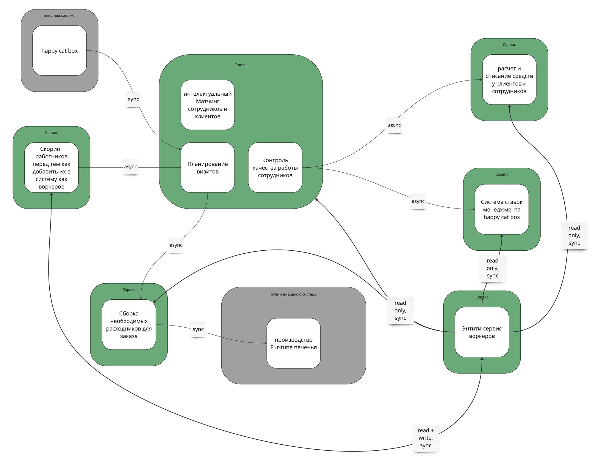
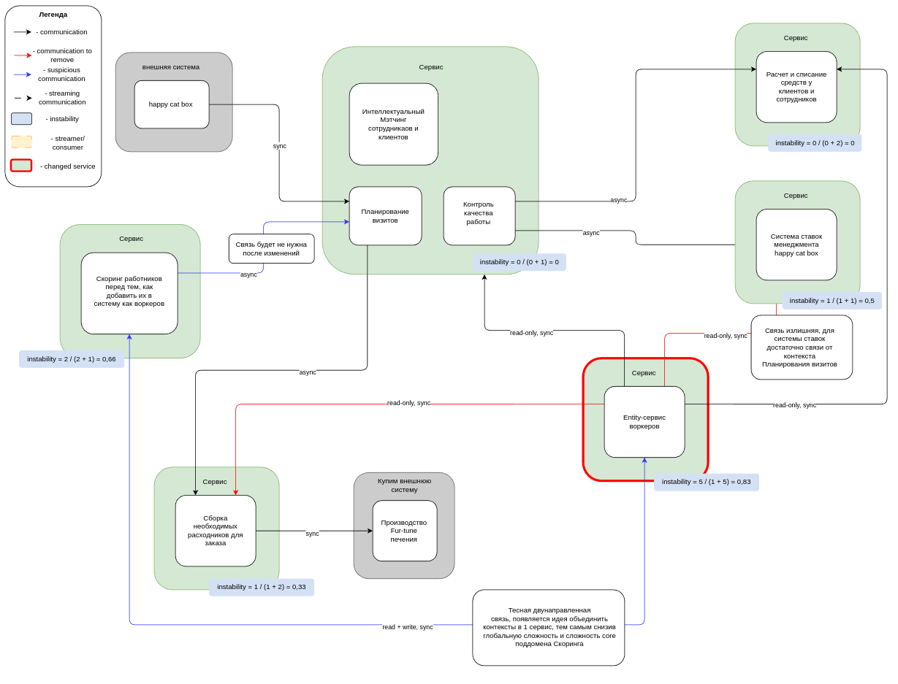
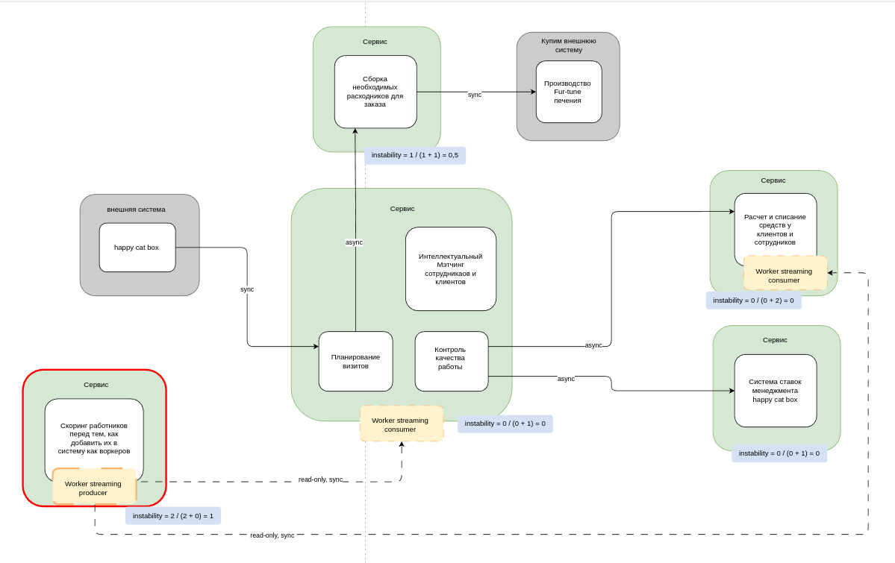
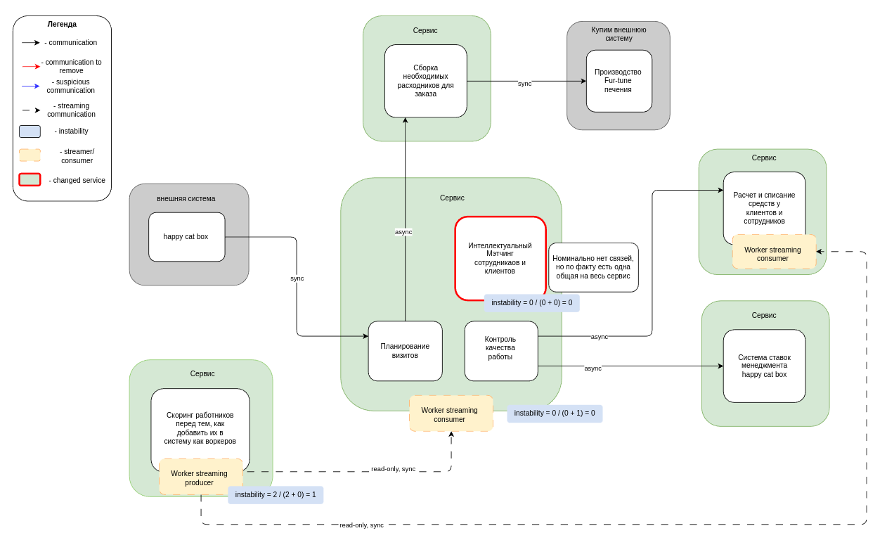
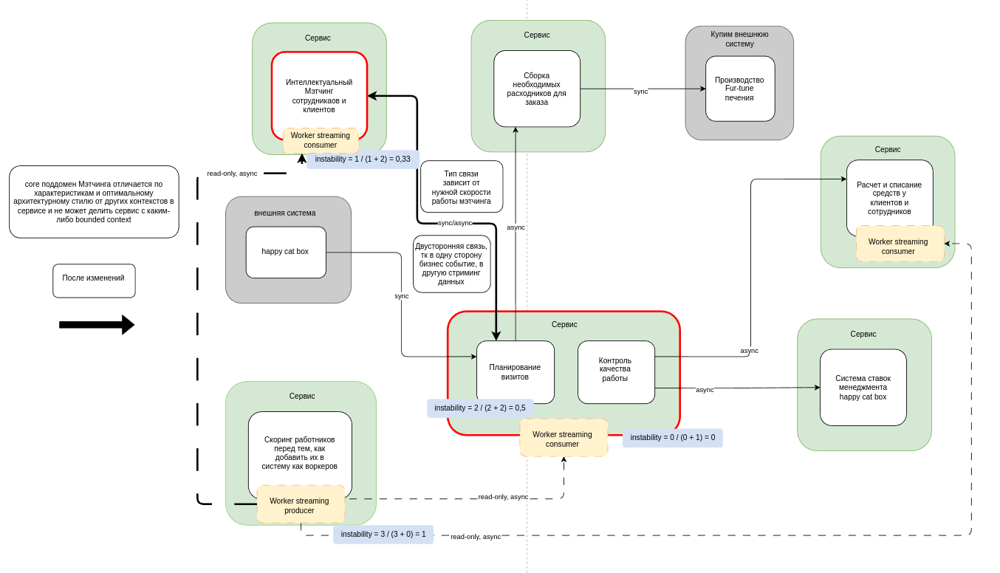
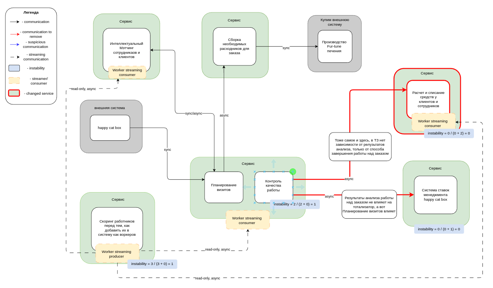
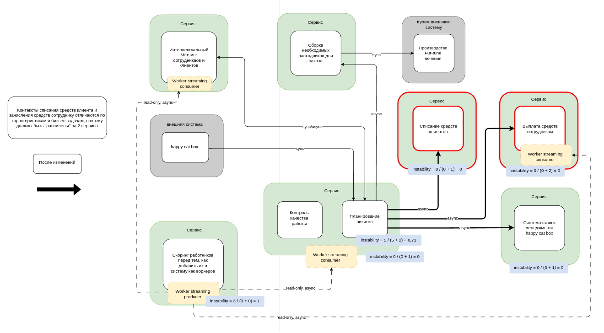

## Содержание

- [Содержание](#содержание)
- [Замечание](#замечание)
- [Instability](#instability)
- [Изменения сервисов и bounded contexts](#изменения-сервисов-и-bounded-contexts)
  - [Удаление Entity-сервиса воркеров](#удаление-entity-сервиса-воркеров)
  - [Вынос Мэтчинга в отдельный сервис](#вынос-мэтчинга-в-отдельный-сервис)
  - [Разбиение биллинга на 2 сервиса](#разбиение-биллинга-на-2-сервиса)
  - [Изменение связей от сервиса Контроля качества](#изменение-связей-от-сервиса-контроля-качества)
- [Планирование изменений структуры системы](#планирование-изменений-структуры-системы)
  - [Ситуация 1 - есть ресурсы, нет опыта и/или инфраструктура](#ситуация-1---есть-ресурсы-нет-опыта-иили-инфраструктура)
    - [Шаг 1 - Изменение связей от сервиса Контроля качества](#шаг-1---изменение-связей-от-сервиса-контроля-качества)
    - [Шаг 2 - Разбиение биллинга на 2 сервиса](#шаг-2---разбиение-биллинга-на-2-сервиса)
    - [Шаг 3 - Удаление Entity-сервиса воркеров](#шаг-3---удаление-entity-сервиса-воркеров)
    - [Шаг 4 - Вынос Мэтчинга в отдельный сервис](#шаг-4---вынос-мэтчинга-в-отдельный-сервис)
  - [Ситуация 2 - нет ресурсов, есть опыт и/или инфраструктура](#ситуация-2---нет-ресурсов-есть-опыт-иили-инфраструктура)
    - [Шаг 1 - Удаление Entity-сервиса воркеров](#шаг-1---удаление-entity-сервиса-воркеров)
    - [Шаг 2 - Вынос Мэтчинга в отдельный сервис](#шаг-2---вынос-мэтчинга-в-отдельный-сервис)
    - [Шаг 3 - Разбиение биллинга на 2 сервиса](#шаг-3---разбиение-биллинга-на-2-сервиса)
    - [Шаг 4 - Изменение связей от сервиса Контроля качества](#шаг-4---изменение-связей-от-сервиса-контроля-качества)

## Замечание

Для работы взял готовую структуру системы, приведенную в уроке. Про нулевую домашку лучше не вспоминать, а в первой слишком много упущений, особенно по связям, что важно в этой домашке. Все изменения отображены в диаграммах в разделе Instability и актуальны для всех 3 заданий

## Instability

Первый кандидат на рефакторинг - entity-сервис воркеров, который планируется "слить" со Скорингом

Instability связанных сервисов после предполагаемых изменений

Следующей итерацией было решено вынести Мэтчинг в отдельный сервис

Instability связанных сервисов после предполагаемых изменений

На последней итерации рассматривается изменение неверных связей контекстов и "распил" биллинга на сервис по списанию средств клиентов и выплате средств сотрудникам

Instability связанных сервисов после предполагаемых изменений

## Изменения сервисов и bounded contexts

### Удаление Entity-сервиса воркеров

Сервис имеет высокое значение instability, так как является единым "местом правды" для информации о воркерах. К тому же все связи от/до этого сервиса синхронные, что не всегда оправдано.
Замена типа связей на асинхронную улучшит ситуацию, но не решит основной проблемы и не снизит риски (неявное влияние на другие сервисы при изменении entity-сервиса)
По аналогии с Happy Cat Box entity-сервис удаляется, а вместо него появляется producer данных воркеров, размещенный в сервисе Скоринга. Со Скорингом была тесная связь на чтение и запись, и удаление этой связи снижает глобальную сложность системы

### Вынос Мэтчинга в отдельный сервис

Следующее напрашивающееся изменение - вынесение core поддомена Мэтчинга в отдельный сервис. На основе опыта, полученного из прошлых уроков, очевидно, что характеристики и консёрны поддомена сильно отличаются от Планирования визитов и Контроля качества. Особенно сильно на решение повлияли характеристики Modifiability и Maintainability. В данном случае вынос в отдельный сервис оправдан, хотя общее число связей в системе увеличивается

### Разбиение биллинга на 2 сервиса

По той же логике, основанной на характеристиках и консёрнах контекстов, сервис биллинга на сервис по списанию средств клиентов и выплате средств воркерам.

### Изменение связей от сервиса Контроля качества

Последним изменением в итерации будут связи контекстов Контроля качества работы с биллингом (который уже разбит на 2 сервиса) и Системой ставок. На основании ТЗ, консёрнов и ES модели можно сказать, что эти 2 связи неверны. Верные связи: от Планирования визитов до 2 сервисов денежным сервисам и от Планирования визитов до Системы ставок.

## Планирование изменений структуры системы

### Ситуация 1 - есть ресурсы, нет опыта и/или инфраструктура

#### Шаг 1 - Изменение связей от сервиса Контроля качества

Судя по текущей схеме системы, разработчики умеют работать с асинхронными связями (а если не умеют, самое время научиться в процессе), поэтому этот шаг видится наиболее простым, хоть и польза от него несравнимо меньше дальнейших шагов.

#### Шаг 2 - Разбиение биллинга на 2 сервиса

Далее остаются изменения критичных частей системы, и наименее критичная из них - биллинг. Предполагая, что не очень опытные разработчики выбрали наиболее дружелюбный вид БД - реляционный, изменение типа БД не потребуется, реляционнная БД подходит по характеристикам и консёрнам.

Паттерн для "распила" монолитного сервиса - Tactical Forking. На определенном этапе bounded contexts списания и выплаты средств мало отличаются, поэтому копирование кода сервиса и удаление ненужной логики выглядит наиболее безопасным и простым решением. К тому же непонятно, насколько необходимы изменения схемы/модели данных, по этой причине был отклонен вариант с Change Data Capture.

В качестве архитектурного стиля для обоих сервисов подходит layered monolith, так как нет специфических требований и характеристик.

#### Шаг 3 - Удаление Entity-сервиса воркеров

Не имеет смысла выполнять двойную работу и усложнять и без того сложную систему, поэтому самый трудный шаг решено выполнить до выноса Мэтчинга в отдельный сервис.

Паттерны для "слияния" не были рассмотрены в уроке, а додуманных ситуаций стоит избегать, поэтому далее просто мысли вслух, без какого-либо паттерна и алгоритма.

Безопаснее и проще выполнять изменения итеративно. Поэтому выбраны следующие итерации:
1. Адаптировать схему БД Скоринга под хранение информации о воркерах
2. Перенести запись и хранение информации о воркерах в сервис Скоринга (основная итерация)
   1. Реализовать producer данных о воркерах
   2. Реализовать consumer данных о воркерах в entity-сервисе
   3. Перенести логику записи и хранения информации в сервис Скоринга
   4. Продьюсить данные в entity-сервис
3. Далее для каждого связи добавить consumer данных в сервис, продьюсить данные и удалить связь с entity-сервисов
4. Когда связей с entity-сервисов не останется, удалить его

#### Шаг 4 - Вынос Мэтчинга в отдельный сервис

Для предполагаемых изменений оптимальным выбором является паттерн Change Data Capture. Во первых, меняется архитектурный стиль на pipeline (неизвестно, какой стиль был до, но на 99% не pipeline). Далее необходимо использовать графовую БД, исходя из требований контекста.

Прошлый шаг затрагивает больше частей системы, но этот шаг как минимум сравним по сложности, так как неопытные разработчики без необходимой инфраструктуры определенно точно помучаются с важным и сложным выносом Мэтчинга.

### Ситуация 2 - нет ресурсов, есть опыт и/или инфраструктура

Реализация шагов остается неизменной, меняется только их порядок.

#### Шаг 1 - Удаление Entity-сервиса воркеров

Информации по работе системы нет, но нетрудно догадаться, что именно это изменение принесет максимальную пользу при сопоставимых усилиях. Проблема слишком всеобъемлюща, поэтому максимально приоритетна.

#### Шаг 2 - Вынос Мэтчинга в отдельный сервис

Со следующим важным шагом тоже без сюрпризов - core поддомен крайне важен и приоритетен компании.

#### Шаг 3 - Разбиение биллинга на 2 сервиса

Далее по важности следуют финансовые операции

#### Шаг 4 - Изменение связей от сервиса Контроля качества

Возможно, в реальной системе это был бы не последний шаг, но неизвестно, насколько неверные связи критичны на данный момент, поэтому это изменение выполняется в последнюю очередь.
